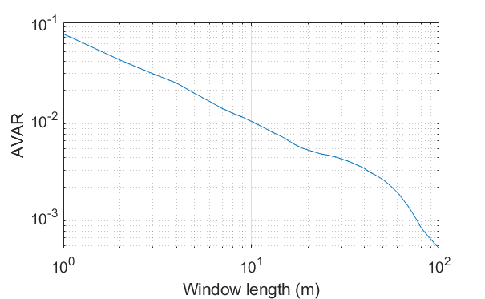
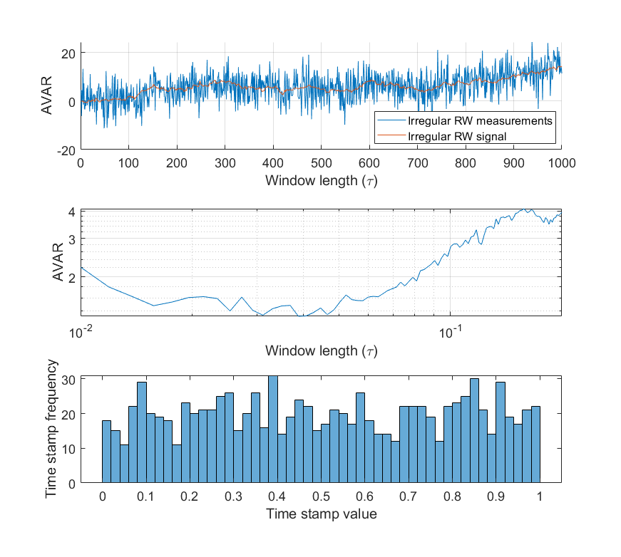

# Allan-Variance
This repository contains functions that calculate Allan variance of the input data

If you use the files, please cite it as:
Haeri, H., Beal, C.E. and Jerath, K., 2020. Near-optimal Moving Average Estimation at Characteristic Timescales: An Allan Variance Approach. IEEE Control Systems Letters.
Available at https://ieeexplore.ieee.org/abstract/document/9268459 

## 1) Use AVAR.m for regularly sampled data:
Regularly sampled data are any time data whose time stamps are evenly spaced and are sampled according to a specific sampling frequency. The Allan variance of such timeseries can be calculated using the classical AVAR estimators like the MATLAB's build-in 'allanvar' function. The function 'AVAR.m' calculates the Allan variance for such data. It takes a timeseries x as a vector and a list of window lengths that AVAR needs to be calculated at. The window length in this function is in units of number of the samples.
'example_regular_white_noise.m' is a simple example which calculates the Allan variance of a white noise signal.
'example_regular_random_walk.m' is another example which calculates the Allan variance of a random walk signal corrupted wuth white Gaussian noise.

## 2) Use AVAR2.m for irregularly sampled data:
For most of the data, the time stamps are not evenly spaced and so the data is irregularly sampled in time. 'AVAR2.m' function estimates the Allan variance of any given data. The 'AVAR2.m' function takes data time stamps, data values, and a list of window lengths that AVAR needs to be calculated at. The window length in this function is in units of time.

