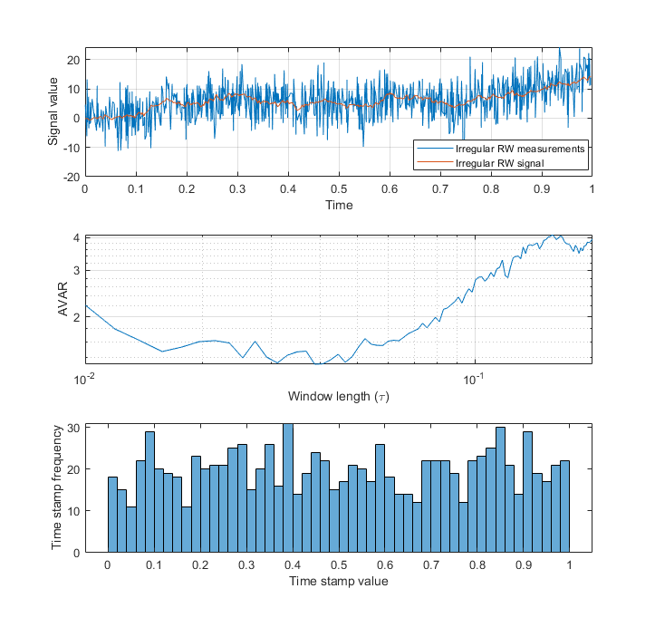

# Allan-Variance
This repository contains functions that calculate Allan variance of the input data

## 1) AVAR for regularly sampled data:
Regularly sampled data are any time data whose time stamps are evenly spaced and are sampled according to a specific sampling frequency. The Allan variance of such timeseries can be calculated using the classical AVAR estimators like the MATLAB's build-in 'allanvar' function. The function 'AVAR.m' calculates the Allan variance for such data. It takes a timeseries x as a vector and a list of window lengths that AVAR needs to be calculated at. The window length in this function is in units of number of the samples.
A simple example would be calculating Allan variance of a white noise signal:
`<addr>` % create a white noise signal
`<addr>`x = rand(1000,1);
`<addr>`% create a list of window lengths
`<addr>`tau = (1:100);
`<addr>`% calculate the AVAR 
`<addr>`avar = AVAR(x, tau);
`<addr>`loglog(tau, avar)
`<addr>`grid on
`<addr>`xlabel('Window length (m)')
`<addr>`ylabel('AVAR')

## 2) AVAR for irregularly sampled data:
For most of the data, the time stamps are not evenly spaced and so the data is irregularly sampled in time. 'AVAR2.m' function estimates the Allan variance of any given data. The 'AVAR2.m' function takes data time stamps, data values, and a list of window lengths that AVAR needs to be calculated at. The window length in this function is in units of time.

